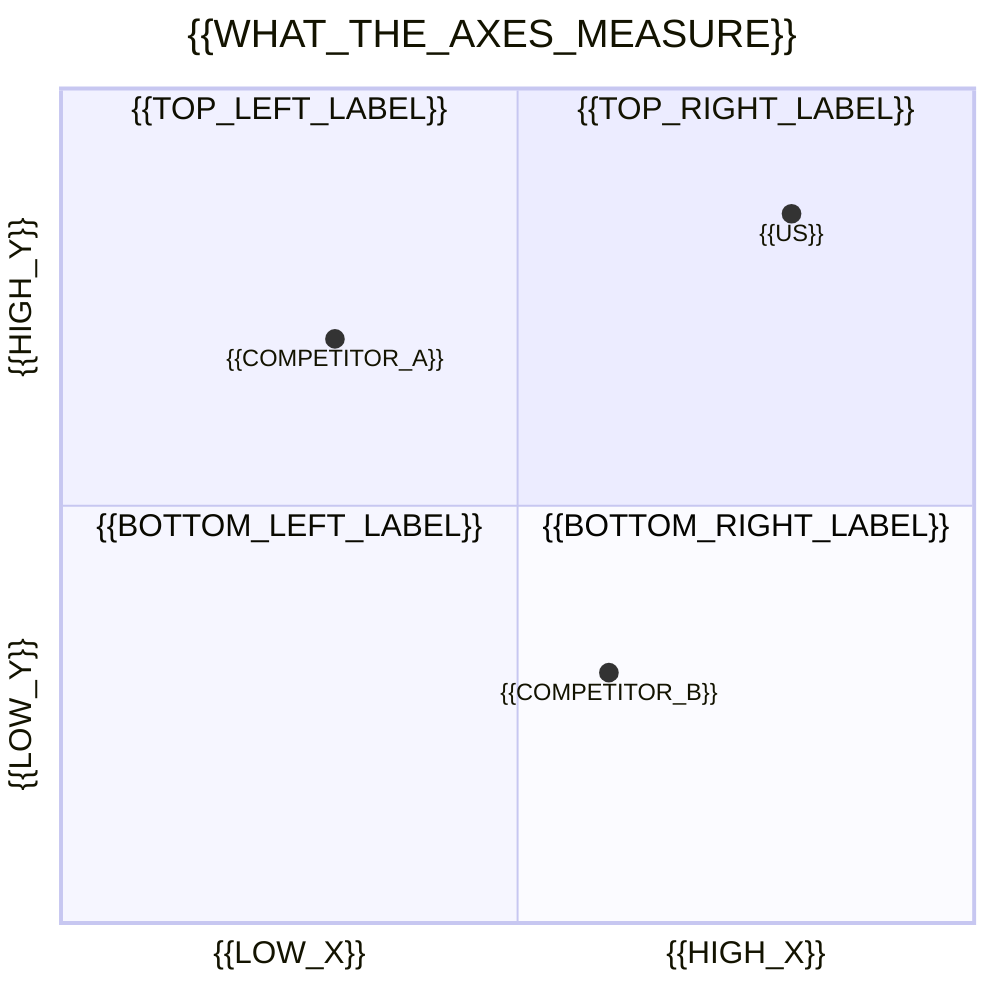

<!--
═══════════════════════════════════════════════════════════════════════════
HACKATHON README TEMPLATE  ·  image-first
Copy to the repo root as README.md, fill {{PLACEHOLDERS}}, delete every HTML
comment, delete every block you can't fill honestly.

THE RULE: a judge scrolling on a phone must learn, in the first screenful,
(1) what this is, (2) what it looks like working, (3) that it's real.

SHOOT THIS LIST AT EVERY HACKATHON (30 min, do it before the deadline panic):
  1. hero.gif        — 10s of the ONE wow moment, under 2MB
  2. shot-01..04.png — four feature screenshots, same window size
  3. architecture.png — how it fits together (Excalidraw is fine)
  4. logo.png        — 512×512, transparent
Put them in docs/assets/ so paths below just work.
═══════════════════════════════════════════════════════════════════════════
-->

<div align="center">


# {{PROJECT}}

### {{ONE_SENTENCE}}

<!--
{{ONE_SENTENCE}} is the hardest line in the file.
  • Plain language. No "revolutionary", "seamless", "powerful", "next-gen".
  • Name the user and the job, not the technology.
  • One sentence. Needs a semicolon? That's two ideas — pick one.
Good: "Fast, native, feature-rich terminal emulator pushing modern features."
Bad:  "A next-generation platform for modern developer workflows."
-->

[]({{DEMO_VIDEO_URL}})
[]({{DEVPOST_URL}})
[](LICENSE)

<!-- Four badges maximum. Each one must help a stranger DECIDE something.
     A wall of twelve is decoration that shoves your description off-screen. -->

**{{HACKATHON_NAME}}** · Built in {{DURATION}} · {{TRACK_OR_PRIZE}}

<br>

<!-- ── HERO ─────────────────────────────────────────────────────────────
The single highest-leverage block in the file. A GIF beats a screenshot;
a screenshot beats nothing. Start MID-ACTION — no splash screen, no cursor
hunting for a menu. 10 seconds. Under 2MB or it won't load on mobile.
-->


<sub><i>{{ONE_LINE_CAPTION_OF_WHAT_JUST_HAPPENED}}</i></sub>

</div>

---

## The problem

<!--
Two or three sentences, concrete and specific. The strongest pattern: name
the tradeoff everyone in this space has quietly accepted, then refuse it.

  "They all force you to choose between speed, features, or native UIs.
   Ghostty provides all three."   ← steal this shape

Judges see forty projects. The ones they remember stated a problem the
judge has personally felt. Lead with the pain, not the market — the numbers
below only land once someone already believes the problem is real.
-->

{{PROBLEM_PARAGRAPH}}

<!-- ── MARKET BAND ──────────────────────────────────────────────────────
Big numbers in table cells. <h2> inside a cell is the trick that makes them
render large on GitHub — there's no inline CSS, so headings are the only
size control you get.

⚠️  EVERY NUMBER NEEDS A REAL SOURCE LINK. A judge who has raised money can
smell an invented TAM instantly, and one fake number discredits the whole
README. If you can't source it, cut the cell — three sourced numbers beat
five made-up ones. Prefer a bottom-up figure (users × price) over a
top-down analyst headline; "$47B market" impresses nobody, "2.1M teams ×
$40/mo" survives follow-up questions.
-->

<div align="center">

<table>
<tr>
<td align="center" width="25%"><h2>{{TAM}}</h2><sub><b>TAM</b><br>{{what it measures}}<br><a href="{{SOURCE_URL}}">source</a></sub></td>
<td align="center" width="25%"><h2>{{SAM}}</h2><sub><b>SAM</b><br>{{the slice you can reach}}<br><a href="{{SOURCE_URL}}">source</a></sub></td>
<td align="center" width="25%"><h2>{{GROWTH}}</h2><sub><b>{{metric}}</b><br>{{why it's moving}}<br><a href="{{SOURCE_URL}}">source</a></sub></td>
<td align="center" width="25%"><h2>{{PAIN_STAT}}</h2><sub><b>{{the cost today}}</b><br>{{unit}}<br><a href="{{SOURCE_URL}}">source</a></sub></td>
</tr>
</table>

</div>

## Why now

<!--
Every pitch needs a timing argument, and it's the question judges ask when
they're actually interested: "why couldn't this exist two years ago?"
Two or three sentences. Good answers name a specific unlock — a capability
that just got cheap, a platform that just opened, a behaviour that just
changed. "AI is big now" is not an answer.
-->

{{WHY_NOW_PARAGRAPH}}

## The insight

<!--
The strongest section in any pitch, and the one most people skip. One or two
sentences naming the non-obvious thing you know that the incumbents don't.
Not a feature. Not "we use AI". A belief about the world that, if true,
makes your approach obviously right and theirs obviously wrong.
Test: could a competitor read this and disagree? If not, it's not an insight,
it's a description.
-->

> **{{THE_INSIGHT_IN_ONE_LINE}}**
>
> {{WHY_IT_CHANGES_THE_APPROACH}}

## What we built

{{SOLUTION_PARAGRAPH}}

<!-- One paragraph. What it does, for whom, and the thing that makes it
     different. Not a feature list — that's next. -->

---

## How it works

<!-- ── FEATURE GRID ─────────────────────────────────────────────────────
A 2×2 image table is the single biggest aesthetic upgrade available in
GitHub markdown. Shoot all four screenshots at the SAME window size or the
grid looks broken. Keep captions to one line.
Fewer than four features? Use a 2×1 — never leave a hole in the grid.
-->

<table>
<tr>
<td width="50%" valign="top">
<br>
<b>{{FEATURE_1}}</b><br>
<sub>{{one line — what it does}}</sub>
</td>
<td width="50%" valign="top">
<br>
<b>{{FEATURE_2}}</b><br>
<sub>{{one line — what it does}}</sub>
</td>
</tr>
<tr>
<td width="50%" valign="top">
<br>
<b>{{FEATURE_3}}</b><br>
<sub>{{one line — what it does}}</sub>
</td>
<td width="50%" valign="top">
<br>
<b>{{FEATURE_4}}</b><br>
<sub>{{one line — what it does}}</sub>
</td>
</tr>
</table>

<!-- Anything that didn't earn a screenshot goes here as plain bullets.
     Every bullet must WORK TODAY. Unshipped things go under Roadmap —
     a feature list that's half roadmap is the fastest way to lose a judge. -->

- **{{FEATURE}}** — {{one clause}}
- **{{FEATURE}}** — {{one clause}}

---

## Try it

<!-- Must be copy-pasteable and must work on a clean machine. Test it on one.
     State prerequisites only if they aren't auto-installed. -->

**Requirements:** {{PREREQS}}

```sh
{{INSTALL_COMMAND}}
{{RUN_COMMAND}}
```

{{WHAT_YOU_SHOULD_SEE}}

<!-- One sentence on what success looks like. Almost every README skips this,
     and it's how a stranger knows it worked. -->

---

## Architecture

<div align="center">

</div>

<!-- A diagram earns its place when the system shape isn't obvious from the
     feature list. Excalidraw or Mermaid both fine. Mermaid renders natively
     on GitHub and costs no screenshot — use it when boxes-and-arrows is
     enough, and a real image when the shape matters visually. -->

{{TWO_SENTENCES_ON_THE_SHAPE_OF_IT}}

<details>
<summary><b>Repo map</b></summary>

| Path | What lives there |
|------|------------------|
| `{{PATH}}` | {{PURPOSE}} |

</details>

<!-- <details> is how you add depth without wrecking the scroll. Use it for
     repo maps, full config reference, long API tables — anything a judge
     won't read but a contributor will. -->

## Built with

<!-- Hackathons care about this, and sponsor tracks often require it.
     Logo badges read far better than a bulleted list of names. -->

<p align="center">


</p>

<!-- Slugs: simpleicons.org — search the tech, use the icon name. -->

## Where we sit

<!-- ── COMPETITIVE QUADRANT ─────────────────────────────────────────────
Mermaid renders NATIVELY on GitHub — no screenshot, no asset, and it stays
readable in dark mode. A quadrant chart is the pitch-deck slide judges
expect, and here it costs you eight lines of text.
Be honest about competitors: naming real ones and showing why you're
different reads as confidence. An empty quadrant with only you in it reads
as someone who didn't look.
-->



{{ONE_SENTENCE_ON_THE_WEDGE}}

### How we compare

<!-- A ✅/❌ matrix is the cheapest credibility in the file — four lines of
     markdown that read as "we actually looked at the landscape".
     Be fair. A table where you win every row reads as dishonest; losing one
     row deliberately makes the rest believable. -->

| | {{COMPETITOR_A}} | {{COMPETITOR_B}} | **{{US}}** |
|---|:---:|:---:|:---:|
| {{CAPABILITY}} | ✅ | ❌ | **✅** |
| {{CAPABILITY}} | ❌ | ✅ | **✅** |
| {{CAPABILITY}} | ❌ | ❌ | **✅** |

## Why it's hard to copy

<!-- The moat question. At a hackathon nobody expects patents — what judges
     want is evidence you've thought past the demo. Real answers: proprietary
     data that compounds, a workflow people won't switch away from, a
     distribution advantage, or genuine technical difficulty. One paragraph. -->

{{MOAT_PARAGRAPH}}

## Business model

<!-- Two or three lines. Who pays, how much, and for what. Even at a
     hackathon this separates "project" from "company" in a judge's head.
     Skip only if you're genuinely open-source-no-revenue and say so. -->

{{MODEL}}

## Traction

<!-- Whatever is true. At a hackathon that may be "built in 36 hours, demoed
     to N people, 3 asked to pilot" — and that's fine. Small real numbers
     beat big vague ones. Delete the section entirely rather than inflate it. -->

{{TRACTION}}

## What's next

<!-- Where unshipped things live. Being explicit here is what lets the
     feature list above stay honest. Judges ask this question out loud.
     A Mermaid timeline reads better than bullets when there are phases. -->

- {{NEXT}}

## Team

<!-- Avatar row reads better than a list. Swap in real GitHub usernames;
     the avatar URL pattern below resolves automatically. -->

<table>
<tr>
<td align="center">
<a href="https://github.com/{{USER}}"><br><sub><b>{{NAME}}</b></sub></a><br><sub>{{ROLE}}</sub>
</td>
<td align="center">
<a href="https://github.com/{{USER}}"><br><sub><b>{{NAME}}</b></sub></a><br><sub>{{ROLE}}</sub>
</td>
</tr>
</table>

## License

{{LICENSE}} — see [LICENSE](LICENSE).

<!--
═══════════════════════════════════════════════════════════════════════════
BEFORE YOU COMMIT

□ Every {{PLACEHOLDER}} filled or its block deleted
□ Every HTML comment stripped
□ hero.gif under 2MB and starts mid-action
□ All four grid screenshots at the same window size
□ Images committed to docs/assets/ (relative paths, not localhost)
□ Tagline is one plain sentence naming a user and a job
□ Feature list contains zero unshipped things
□ Quickstart tested on a clean machine
□ Every link resolves — dead links read as abandoned
□ Opened on a phone; GitHub mobile is where wide tables break

CUT ORDER when it gets long: Repo map → Config → Architecture → What's next.
Hero, problem, feature grid and Try it always stay.
═══════════════════════════════════════════════════════════════════════════
-->
