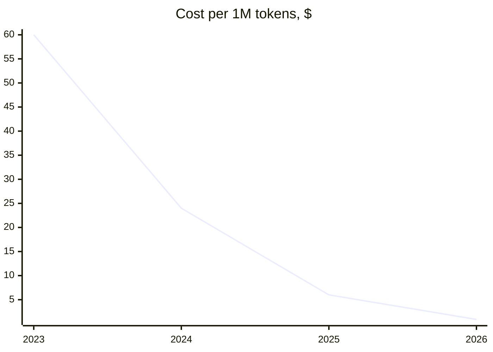
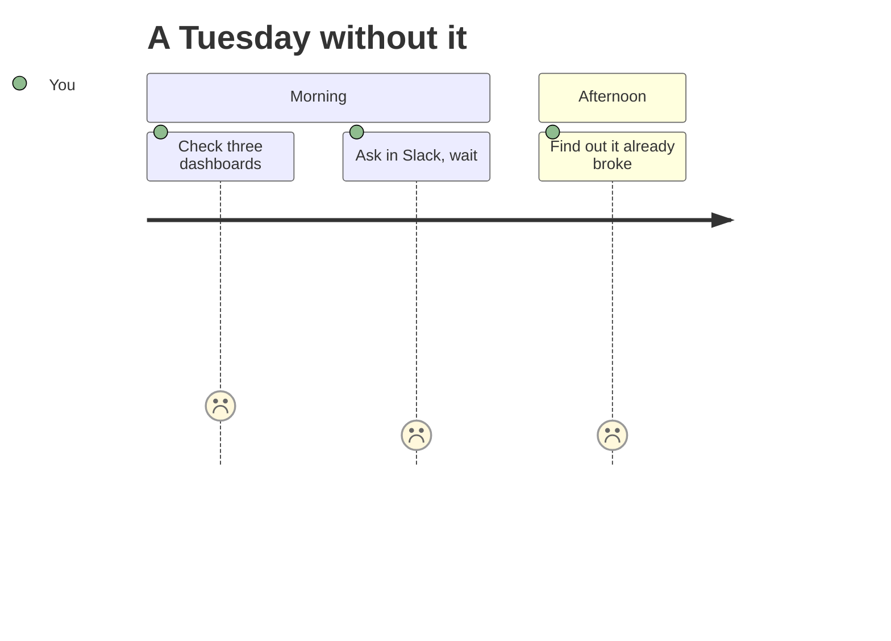
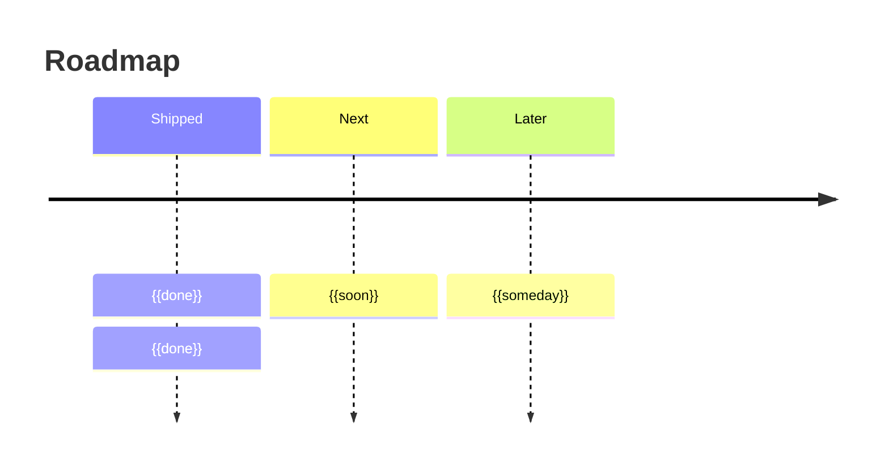
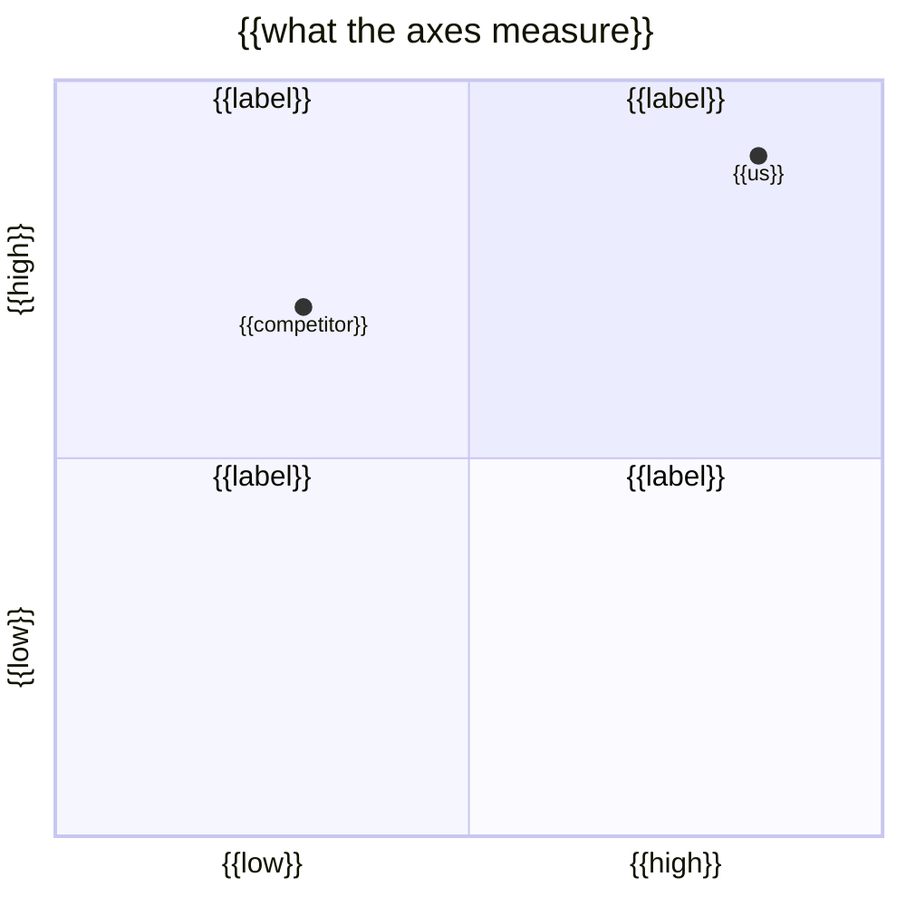
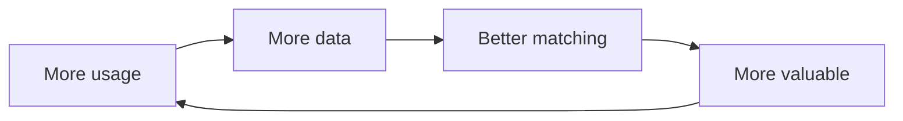
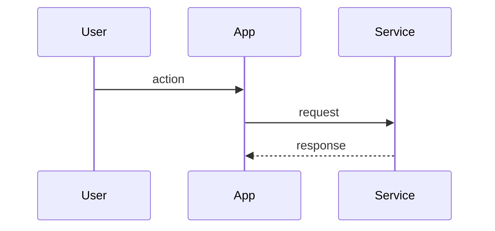

# Blocks

Swappable visuals for either layout. Each block lists **where it fits**, **the rule** that makes it work, and the snippet. Any block can go in any section — the layouts just name a sensible default.

> [!NOTE]
> Mermaid, `> [!ALERT]` boxes, footnotes and task lists render on **github.com only** — not in grip, VS Code preview or Quick Look. Check diagrams at [mermaid.live](https://mermaid.live) before shipping.

---

## Hero & top

### `hero-centered`
**Fits:** top of any layout. **Rule:** caption the media — people watch a loop twice without understanding it, and one italic line fixes that free.

```html
<div align="center">


# {{PROJECT}}
### {{ONE_SENTENCE}}


<sub><i>{{what just happened}}</i></sub>
</div>
```

### `typing-svg`
**Fits:** hero, terminal-flavoured projects. **Rule:** two lines maximum, or it reads as a toy.

```html

```

### `picture-dark-light`
**Fits:** any image. **Rule:** use it for every screenshot with a background — a light shot on a dark theme is the most common ugly thing in READMEs.

```html
<picture>
  <source media="(prefers-color-scheme: dark)" srcset="docs/assets/hero-dark.png">
  
</picture>
```

### `anchor-nav`
**Fits:** under badges. **Rule:** four links maximum, and every one must resolve.

```html
<a href="#quickstart">Quickstart</a> · <a href="#how-it-works">How it works</a> · <a href="#configuration">Config</a>
```

---

## Argument

### `pull-quote`
**Fits:** problem, insight. **Rule:** one sentence, and it must be the sharpest one you have — this is what a scroller reads.

```markdown
> **The CRM records what already happened. Nobody records what's about to.**
```

### `two-part-blockquote`
**Fits:** the insight section. **Rule:** the disagreement test — if no competent competitor would argue with it, it's a description, not an insight.

```markdown
> **{{The one-line belief.}}**
>
> {{Why it makes the incumbent approach wrong.}}
```

### `positioning-statement`
**Fits:** anywhere a quadrant would oversimplify. **Rule:** boring to write, impossible to argue with. Fill every slot.

```markdown
**For** {{user}} **who** {{situation}}**, {{PROJECT}} is a** {{category}} **that** {{benefit}}**. Unlike** {{incumbent}}**, it** {{difference}}**.**
```

### `before-after-table`
**Fits:** problem, or "what is this" in dev-tool. **Rule:** rows are moments, not features. The most underused generic device available, and it works for every project.

```markdown
| Today | With {{PROJECT}} |
|---|---|
| {{the tedious current path}} | {{the new path}} |
| {{what breaks}} | {{what doesn't}} |
```

---

## Data & charts

### `stat-band`
**Fits:** under the problem. **Rule:** source every cell visibly. `<h2>` inside `<td>` is the only size control GitHub gives you — there's no inline CSS.

```html
<table><tr>
<td align="center" width="25%"><h2>{{N}}</h2><sub><b>{{LABEL}}</b><br>{{what it measures}}<br><a href="{{URL}}">source</a></sub></td>
<td align="center" width="25%"><h2>{{N}}</h2><sub><b>{{LABEL}}</b><br>{{what it measures}}<br><a href="{{URL}}">source</a></sub></td>
</tr></table>
```

Make one cell the **pain**, not the market — three market numbers and one "costs teams X hours/week" lands harder than four market numbers.

### `xychart`
**Fits:** market growth, cost collapse, benchmarks. **Rule:** native bar and line charts, zero assets. This is what uv used a real image for.

````markdown

````

Swap `line` for `bar`, or use both in one chart.

### `footnotes`
**Fits:** any derived number. **Rule:** show the arithmetic for anything you calculated — it's what makes bottom-up numbers survive questioning.

```markdown
2.1M teams[^1]

[^1]: Derived from {{source}}, assuming {{assumption}}.
```

### `journey`
**Fits:** the problem, when the pain is a sequence of small frictions. **Rule:** the 1-5 scores render as faces — unreasonably good at making frustration legible.

````markdown

````

### `timeline`
**Fits:** why now, roadmap. **Rule:** the Shipped column does credibility work — always lead with it.

````markdown

````

---

## Comparison

### `quadrant`
**Fits:** competitive positioning. **Rule:** pick axes that are *real tradeoffs* — if nobody could rationally prefer the other end, it isn't an axis. Put a real competitor near you; an empty quadrant says you didn't look.

````markdown

````

### `matrix-3state`
**Fits:** after the quadrant. **Rule:** **lose at least one row on purpose.** A table you win outright reads as dishonest and discounts every other row. Six rows maximum. Use ➖ for partial — three states read as more honest than binary.

```markdown
| | {{COMPETITOR}} | {{COMPETITOR}} | **{{US}}** |
|---|:---:|:---:|:---:|
| {{capability}} | ✅ | ➖ | **✅** |
| {{capability}} | ❌ | ❌ | **✅** |
| {{capability}} | ✅ | ✅ | **❌** |
```

Rows are capabilities, not products — "works offline", not "our sync engine".

### `flywheel`
**Fits:** the moat. **Rule:** only use it if the loop is real. Makes "it compounds" visible instead of asserted.

````markdown

````

---

## Product & features

### `grid-2x2`
**Fits:** the features section. **Rule:** all four screenshots at the **same window size**, and caption the *outcome*, not the widget — "never merge into someone else's edit" beats "conflict panel".

```html
<table>
<tr>
<td width="50%" valign="top">
<br>
<b>{{FEATURE}}</b><br><sub>{{one line}}</sub>
</td>
<td width="50%" valign="top">
<br>
<b>{{FEATURE}}</b><br><sub>{{one line}}</sub>
</td>
</tr>
</table>
```

Fewer than four features? Use 2×1. Never leave a hole in the grid.

### `numbered-flow`
**Fits:** features that are sequential rather than parallel. **Rule:** use instead of the grid when order matters.

```markdown
| **1 · {{Step}}** | **2 · {{Step}}** | **3 · {{Step}}** |
|---|---|---|
|  |  |  |
```

### `tier-table`
**Fits:** business model. **Rule:** one concrete price. A number reads as thought-through; a range reads as evasion.

```markdown
| | Free | Pro | Team |
|---|:---:|:---:|:---:|
| {{limit}} | {{n}} | ∞ | ∞ |
| Price | $0 | ${{x}}/mo | ${{y}}/seat |
```

---

## Technical

### `mermaid-flowchart`
**Fits:** architecture. **Rule:** draw the non-obvious *decision*, not the obvious flow. Follow it with two sentences naming the tradeoff you made and what it bought — that's what a technical reader is here for.

````markdown
```mermaid
flowchart LR
    A[{{input}}] --> B[{{the interesting part}}]
    B --> C[(( {{state}} ))]
    B --> D[{{output}}]
```
````

### `sequence-diagram`
**Fits:** architecture, when *ordering* is the interesting part.

````markdown

````

### `terminal-transcript`
**Fits:** quickstart, CLI. **Rule:** show **output**, not just input — it lets people diagnose their own failure. Use the `console` language tag.

````markdown
```console
$ npm run dev
✓ ready on http://localhost:3000
```
````

---

## Interaction & polish

### `alert-callout`
**Fits:** one per layout, at the single worst gotcha. **Rule:** **two per README maximum.** A third makes all of them invisible.

```markdown
> [!IMPORTANT]
> {{the thing that would otherwise eat an hour}}
```

Available: `NOTE` `TIP` `IMPORTANT` `WARNING` `CAUTION`.

### `details-fold`
**Fits:** repo maps, troubleshooting, full config, FAQ. **Rule:** fold everything a judge won't read but a contributor will. Depth without scroll cost is markdown's main structural advantage.

```markdown
<details>
<summary><b>{{Question or symptom}}</b></summary>

{{answer}}

</details>
```

### `kbd-keys`
**Fits:** anywhere you name a shortcut. **Rule:** tiny, and almost nobody does it.

```html
<kbd>⌘</kbd><kbd>K</kbd>
```

### `task-list`
**Fits:** what's next. **Rule:** link each item to an issue so the roadmap is verifiable rather than decorative.

```markdown
- [ ] {{item}}
- [x] {{shipped}}
```

---

## People

### `team-avatars`
**Fits:** team. **Rule:** one clause on what each person *owns*, not their job title. Avatars resolve automatically from the username — no asset needed.

```html
<table><tr>
<td align="center">
<a href="https://github.com/{{user}}"><br><sub><b>{{Name}}</b></sub></a><br><sub>{{what they own}}</sub>
</td>
</tr></table>
```

Add a why-us line if the team has non-obvious authority — prior experience with this exact problem is the strongest thing you can say, and most people leave it out.

### `stat-chips` / `star-history` / `contrib-wall`
**Fits:** traction. **Rule:** small and real beats big and vague. **Delete the section** rather than pad it — an absent section costs nothing, an inflated one costs trust for the whole page.

```markdown


[](https://star-history.com/#{{owner}}/{{repo}})


```

Live GitHub badges (stars, last commit, open issues) are honest precisely because you don't control them. A real one-sentence user quote beats any number at early stage.

---

## Whole-document

- **Dividers (`---`) mark act breaks**, not every section — pitch turning into product, product turning into detail.
- **Emoji as section anchors, not decoration.** One per major heading at most, or none.
- **Read it once at phone width.** Wide tables and the 2×2 grid are where GitHub mobile breaks, and mobile is half your readers.
- **Cut order when it runs long:** traction → moat → business model → repo map → architecture. Hero, problem, insight, feature grid and Try it always stay.
