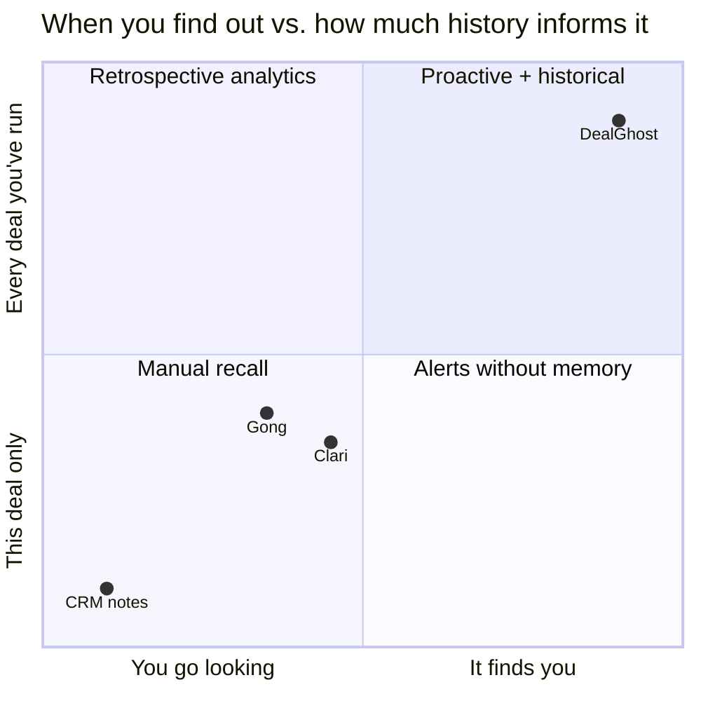
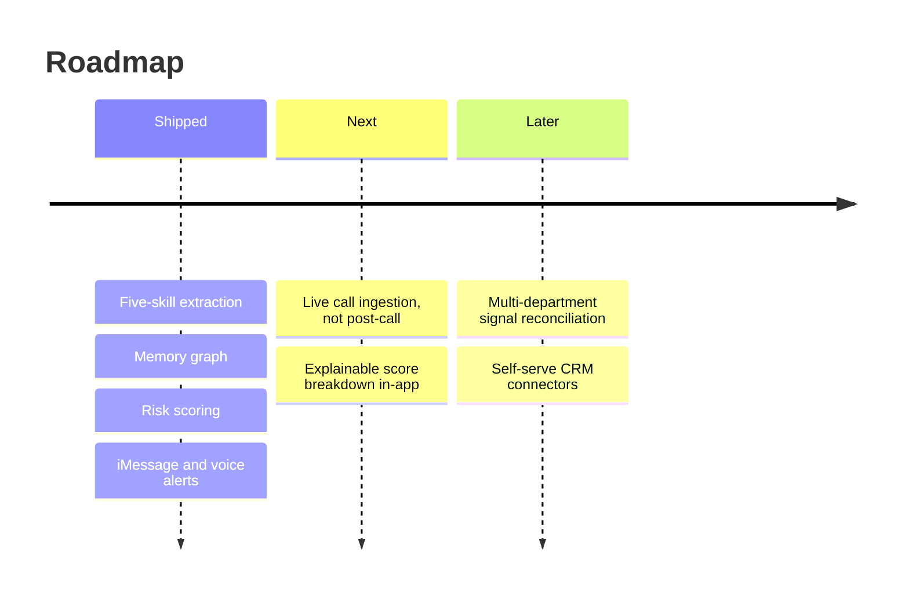

<!-- EXAMPLE 3 — the showcase layout filled with a REAL project (aryanmotgi/DealGhost).
     Product content is accurate to the repo. Images are sized placeholders.

     ⚠️ EVERY NUMBER IN THE MARKET BAND IS A PLACEHOLDER MARKED "verify".
     Do not publish this until each one has a real, clickable source. -->

<div align="center">


# DealGhost

### The deal died three weeks ago. Somebody said so on a call, and nobody heard it.

[](#)
[](#)
[](LICENSE)

**Built in 36 hours** · Revenue intelligence

<br>


<sub><i>A live call transcript lands. Five extraction passes run in parallel, the memory graph matches it to a deal that churned last quarter, and the rep's phone buzzes before they've left the meeting.</i></sub>

</div>

---

## The problem

Every signal that kills a deal gets said out loud, on a call, weeks before anyone admits the deal is dead. The champion mentions they're "exploring options." Procurement gets named for the first time. The tone on pricing shifts. All of it is captured — sales teams record everything now — and none of it is ever read again. The CRM ends up as a graveyard of what already happened, updated by the rep who least wants to admit a deal is slipping, and the first anyone *knows* is when the renewal doesn't close.

<div align="center">

<table>
<tr>
<td align="center" width="25%"><h2>$—B</h2><sub><b>TAM</b><br>Revenue intelligence software<br><a href="#">verify</a></sub></td>
<td align="center" width="25%"><h2>$—B</h2><sub><b>SAM</b><br>Mid-market teams using call recording<br><a href="#">verify</a></sub></td>
<td align="center" width="25%"><h2>—%</h2><sub><b>Forecast error</b><br>Average B2B forecast miss<br><a href="#">verify</a></sub></td>
<td align="center" width="25%"><h2>—%</h2><sub><b>Of calls re-read</b><br>Recorded calls anyone revisits<br><a href="#">verify</a></sub></td>
</tr>
</table>

<sub>⚠️ Placeholders — replace each with a real figure and a real source before publishing.</sub>

</div>

## The insight

> **Call recording solved capture. Nobody solved recall.**
>
> Every tool in this category treats a call as a document to search *after* you already suspect something is wrong. But the rep doesn't know to go looking — that's the entire failure. The useful unit isn't the transcript, it's the *pattern across transcripts*: this deal is starting to sound like the one that churned in Q2. That comparison can only be made by something holding every past deal in memory at once, and it has to arrive uninvited.

## Why now

Running five separate extraction passes over every call used to be a line item you'd have to justify; inference got cheap enough this year that it's a rounding error, so we extract aggressively instead of selectively. And embeddable graph databases mean the cross-deal memory runs in-process — no cluster, no separate service, no per-seat infrastructure cost standing between a small team and the product.

## What we built

DealGhost ingests a sales-call transcript, runs five extraction skills over it in parallel — pain points, objections, sentiment, product fit, relationship health — and writes the resulting signals into a persistent revenue memory built on Postgres plus a Kuzu graph. Every new call is matched against the shape of deals that already closed or churned. When a live deal starts tracking a known failure pattern, DealGhost scores the risk and fires an iMessage to the rep, with a Twilio call for the worst cases. You don't open a dashboard to find out. It tells you.

---

## How it works

<table>
<tr>
<td width="50%" valign="top">
<br>
<b>Five passes, one call</b><br>
<sub>Pain points, objections, sentiment, product fit and relationship health extracted in parallel — each a separate structured signal, not a summary.</sub>
</td>
<td width="50%" valign="top">
<br>
<b>Revenue memory graph</b><br>
<sub>Signals become nodes in a Kuzu graph that spans every deal, so the system compares across accounts, not just within one.</sub>
</td>
</tr>
<tr>
<td width="50%" valign="top">
<br>
<b>Pattern match → risk score</b><br>
<sub>A live deal is scored 0–100 against historical churn shapes. The score is explainable: it names the past deal it resembles.</sub>
</td>
<td width="50%" valign="top">
<br>
<b>It comes to you</b><br>
<sub>High risk fires an iMessage via Photon Spectrum, and a Twilio call at the top of the range — with per-company cooldown so it never spams.</sub>
</td>
</tr>
</table>

- **Action ledger** — every alert, decision and CRM write is appended to an auditable log.
- **Playbook** — turns matched patterns into the specific next move that saved the comparable deal.
- **Graceful degradation** — every pipeline step is individually guarded; a failed extraction falls back rather than dropping the call.

---

## Where we sit



### How we compare

| | CRM notes | Gong | Clari | **DealGhost** |
|---|:---:|:---:|:---:|:---:|
| Captures what was said | ❌ | ✅ | ❌ | **✅** |
| Scores deal risk | ❌ | ✅ | ✅ | **✅** |
| Compares against *past* deals | ❌ | ❌ | ❌ | **✅** |
| Reaches you before you ask | ❌ | ❌ | ❌ | **✅** |
| Enterprise integrations | ✅ | ✅ | ✅ | ❌ |

We lose the last row on purpose — Gong and Clari have years of integration work we don't. The bet is that cross-deal memory matters more than breadth of connectors.

## Why it's hard to copy

The memory graph compounds with use and can't be bought. Every closed or churned deal makes the next pattern match sharper, and that history is specific to one company's product, market and sales motion — a competitor starting today starts with an empty graph, and so does every customer they win. The extraction skills are replicable in a weekend. The accumulated shape of *your* deals is not.

## Business model

Per-seat SaaS for revenue teams, priced under the call-recording tools it sits alongside rather than replacing them — DealGhost consumes transcripts, so it's additive to an existing Gong deployment instead of a rip-and-replace.

## Traction

Built in 36 hours. Demoed end to end on a live transcript with a real iMessage landing on a real phone. *(Replace with whatever is actually true — small real numbers beat big vague ones, and an empty section beats an inflated one.)*

---

## How it fits together

```mermaid
flowchart LR
    A[📞 Call transcript] --> B[5 Nebius skills<br/>in parallel]
    B --> C[Signal&#91;&#93;]
    C --> D[(Postgres<br/>durable store)]
    C --> E[(Kuzu graph<br/>cross-deal memory)]
    E --> F{Pattern match<br/>vs. past deals}
    D --> F
    F --> G[Risk score 0–100]
    G -->|high| H[📱 iMessage · Photon]
    G -->|critical| I[☎️ Twilio call]
    G --> J[Action ledger]
```



Extraction, storage and alerting are separate stages with guards between them, so a failure in any one degrades that call rather than the pipeline.

<details>
<summary><b>Repo map</b></summary>

| Path | What lives there |
|------|------------------|
| `app/api/` | Server routes — analyze, match, alert, signals, ledger, CRM update |
| `lib/nebius.ts` | The five extraction skills and the OpenAI-compatible client |
| `lib/pipeline.ts` | Orchestrator — transcript in, risk context out, guarded at every step |
| `lib/kuzu.ts` | Graph memory: signals and deals as nodes, patterns as traversals |
| `lib/photon.ts` · `lib/twilio.ts` | iMessage and voice delivery |
| `app/graph/` | Force-directed view of the revenue memory |

</details>

## Try it

**Requirements:** Node 18+, a Nebius API key, and Postgres.

```sh
git clone https://github.com/aryanmotgi/DealGhost && cd DealGhost
npm install
cp .env.example .env.local   # Nebius, database and Photon credentials
npm run dev
```

> [!IMPORTANT]
> The Nebius base URL must be `https://api.studio.nebius.com/v1/` — the client is OpenAI-compatible, but the default endpoint will not work.

Open `localhost:3000` and seed a transcript from the dashboard. You should see five signals appear, the graph gain nodes, and a risk score resolve within a few seconds.

## Built with

<p align="center">


</p>

## What's next



## Team

<table>
<tr>
<td align="center">
<a href="https://github.com/aryanmotgi"><br><sub><b>Aryan</b></sub></a><br><sub>Product surface — pages, graph view, schema</sub>
</td>
<td align="center">
<a href="https://github.com/ssmoney1"><br><sub><b>Shreyash</b></sub></a><br><sub>The brain — extraction, pattern matching, alerting</sub>
</td>
</tr>
</table>

## License

MIT — see [LICENSE](LICENSE).
