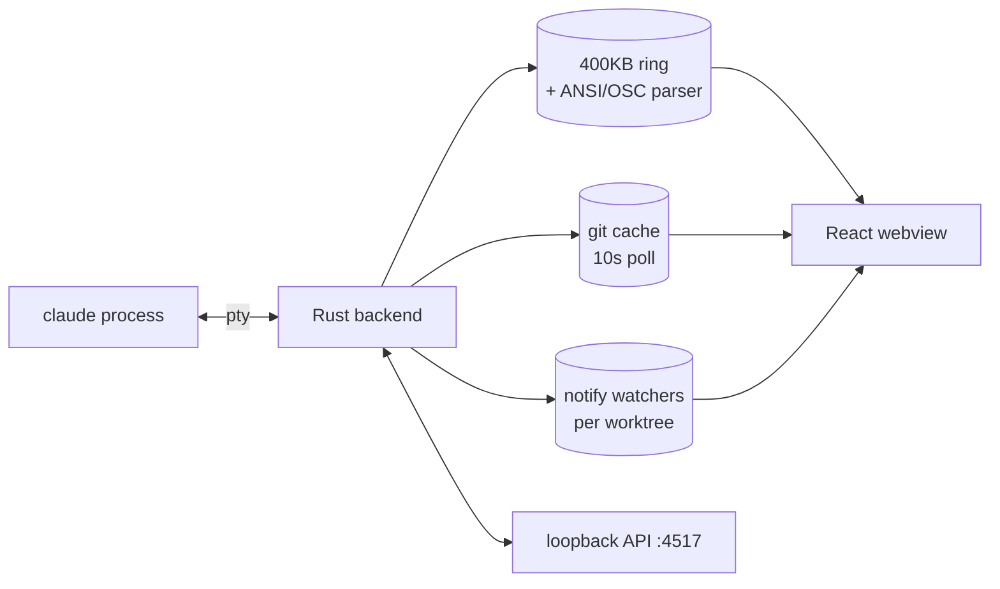

<!-- EXAMPLE — the DEV-TOOL layout, filled with real content from this repo.
     Images are sized placeholders; swap docs/assets/* in and the paths work.
     Compare against examples/dealghost.md to see the same project content
     would look under the showcase layout. -->

<div align="center">


# Grill Me

### Run and supervise many Claude Code sessions from one window.


<a href="#quickstart">Quickstart</a> ·
<a href="#how-it-works">How it works</a> ·
<a href="#configuration">Config</a> ·
<a href="#troubleshooting">Troubleshooting</a>

<br>


<sub><i>A six-item checklist pasted into fan-out: each independent item gets its own git worktree, branch, and live Claude session.</i></sub>

</div>

---

## What is this

Every session is a real `claude` process on a pty, not a log tail — so you can watch it, type into it, review its diff and ship it without leaving the window. Running four agents in four terminal tabs already works; what doesn't work is *noticing*. Nobody sees that session two has been stalled for twenty minutes, that three and four are editing the same file, or what any of it cost. Grill Me holds the keyboard end of every terminal, so the app can watch all of them at once and act on what it sees.

| Four terminal tabs | Grill Me |
|---|---|
| You notice a stall when you look | Flagged at 5 minutes, with a sound |
| Conflicts surface at merge | File claims collide live, with a banner |
| Idle TUIs burn 10-25% CPU each | Auto-SIGSTOP, resumed the instant you look |
| Token spend is invisible | Per-session tallies from the real transcripts |

## Quickstart

**Requirements:** macOS, Node 18+, a Rust toolchain, and `claude` working in a fresh login shell.

```sh
git clone https://github.com/aryanmotgi/grill-me-app && cd grill-me-app
npm install
npm run tauri dev
```

The project picker opens first. Point it at a git repo and Grill Me registers it, seeds a one-member team config, and spawns your first session inside it. First build compiles ~400 Rust crates and takes 5-15 minutes; every build after that is incremental.

> [!IMPORTANT]
> Sessions spawn with `--dangerously-skip-permissions`. The only guardrail is a regex blocklist installed as a PreToolUse hook — point Grill Me at a scratch repo before anything you care about, and check Settings → Safety before your first real session.

---

## How it works

<table>
<tr>
<td width="50%" valign="top">
<br>
<b>Fan-out</b><br>
<sub>Paste a checklist. Independent items each get a worktree, a branch and a session; dependent ones wait on the board and auto-start.</sub>
</td>
<td width="50%" valign="top">
<br>
<b>File claims</b><br>
<sub>One <code>notify</code> watcher per worktree. Two sessions claiming one file raises a full-width banner.</sub>
</td>
</tr>
<tr>
<td width="50%" valign="top">
<br>
<b>Review &amp; ship</b><br>
<sub><kbd>⌘</kbd><kbd>S</kbd> opens commits-ahead, diffstat, full diff and an AI review. Approve types <code>/ship</code> into that session.</sub>
</td>
<td width="50%" valign="top">
<br>
<b>Blocklist &amp; audit</b><br>
<sub>PreToolUse checks every Bash command against <code>blocklist.json</code> and fails closed. PostToolUse appends to <code>audit.jsonl</code>.</sub>
</td>
</tr>
</table>

- **Honest status** — Claude Code hooks first, terminal OSC 9/99/777 second, output-quiet heuristics last. Every status dot traces to a process signal.
- **Stall and loop detection** — flags a session gone silent past a threshold, or one whose screen tail keeps repeating (Jaccard similarity, spinner frames filtered out).
- **Auto-pause** — `SIGSTOP` on the process group after an idle threshold, `SIGCONT` the instant you view or type. Never pauses a session that needs input.
- **Token cap** — a hard per-session budget stop, counted from real transcript tallies.
- **Control API** — token-protected loopback HTTP on `127.0.0.1:4517` plus a `grillme` CLI, so one agent can drive the others.

## Architecture



Rust owns everything durable — pty ring buffers, the git cache, file watchers, the control API — and React is a disposable renderer over polling feeds. That tradeoff costs latency (every feed is a 1.5-30 second poll rather than an event stream) and buys a webview that can reload without losing a single byte of scrollback, because no state lives in the page.

<details>
<summary><b>Repo map</b></summary>

| Path | What lives there |
|------|------------------|
| `src-tauri/src/lib.rs` | Pty layer, git cache, watchers, hooks installer, control API |
| `src-tauri/src/room.rs` | LAN room protocol — shared tasks, messages, decisions |
| `src-tauri/src/bridge.rs` | MCP server install, skill playbooks, Claude-app bridge |
| `src/data/sources/` | Polling feeds that turn backend state into store patches |
| `src/lib/` | Pure, unit-tested logic — attention, stall, cost cap, presence |

</details>

## Configuration

Everything lives under `~/.grillme`.

| Path | What it holds |
|---|---|
| `config.json` | Team members: name, repo path, permission, optional ssh/tmux target |
| `blocklist.json` | Regexes denied at PreToolUse. Malformed = fails closed |
| `settings.json` | App settings — auto-pause threshold, token cap, quiet hours, templates |
| `api-token` | 32 CSPRNG bytes, mode `0600`, for the loopback API |
| `skills/*.md` | Playbooks served to the Claude app over MCP |

## CLI

Installed to `~/.grillme/bin/grillme` on first launch.

```console
$ grillme sessions
[{"id":"me","alive":true,"quietMs":1840,"status":"working"}]

$ grillme send me "run the tests"
{"ok":true}

$ grillme read me 20
```

## Troubleshooting

<details>
<summary><b><code>claude</code> not found, or sessions die instantly</b></summary>

Sessions spawn via `/bin/zsh -lc`, so the **login-shell** PATH is what matters. If `zsh -lc "claude --version"` fails in a terminal, fix that first — re-run the Claude Code installer or add its bin directory to `~/.zprofile`.

</details>

<details>
<summary><b>Every Bash command is blocked</b></summary>

The PreToolUse hook exits 2 when it can't find or parse its blocklist — that's fail-closed by design. Check that `.claude/settings.json` in the target repo points at **your** home directory, and that `~/.grillme/bin/grillme-hook` and `~/.grillme/blocklist.json` both exist. A stale settings file committed by another machine's user is the usual cause.

</details>

<details>
<summary><b>Port 4517 already in use</b></summary>

Sessions still work, but the `grillme` CLI and agent orchestration won't. Free the port and relaunch.

</details>

## Development

```sh
npm install
npm run tauri dev     # native app
npm run dev           # browser only — sample data, no terminals
npx vitest run        # 365 tests
cargo test --manifest-path src-tauri/Cargo.toml
```

Pure logic lives in `src/lib/` as framework-free functions so the invariants — what counts as needing attention, when a session may be paused, when a cap fires — are unit-testable without a Tauri backend. Anything stateful belongs in Rust.

## Built with

<p align="center">


</p>

## What's next

- [ ] Stream ptys over the LAN room so teammates on other machines can watch
- [ ] Hunk-level conflict detection instead of filename overlap
- [ ] Gate review &amp; ship on green CI and a predicted-conflict check
- [ ] Session teardown — kill pty, remove worktree, drop from config

## License

MIT — see [LICENSE](LICENSE).
