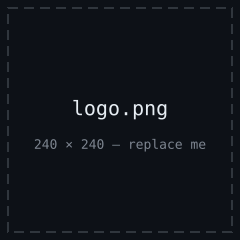
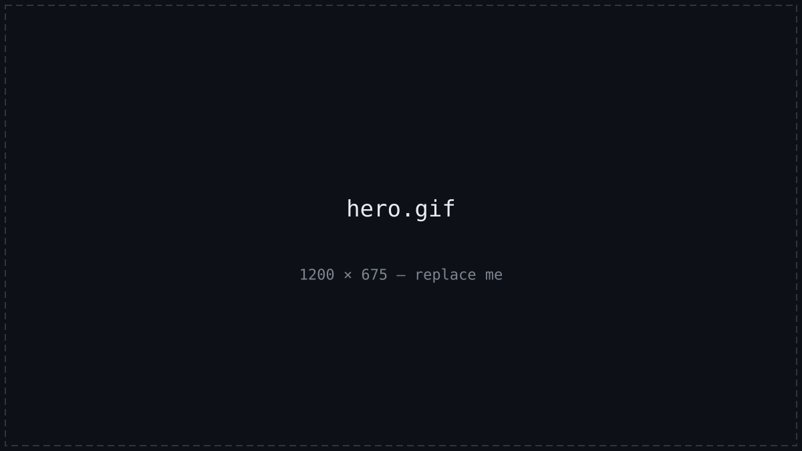
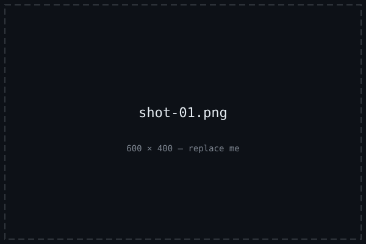
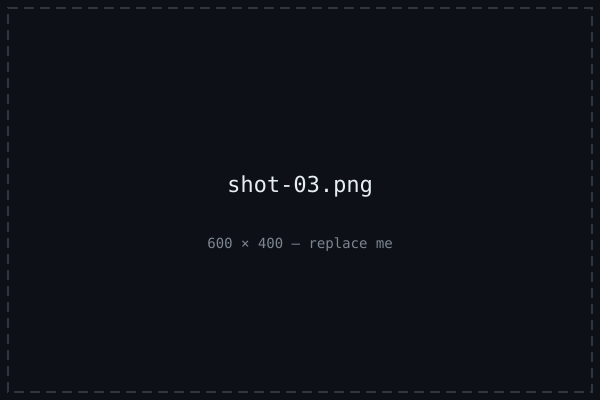
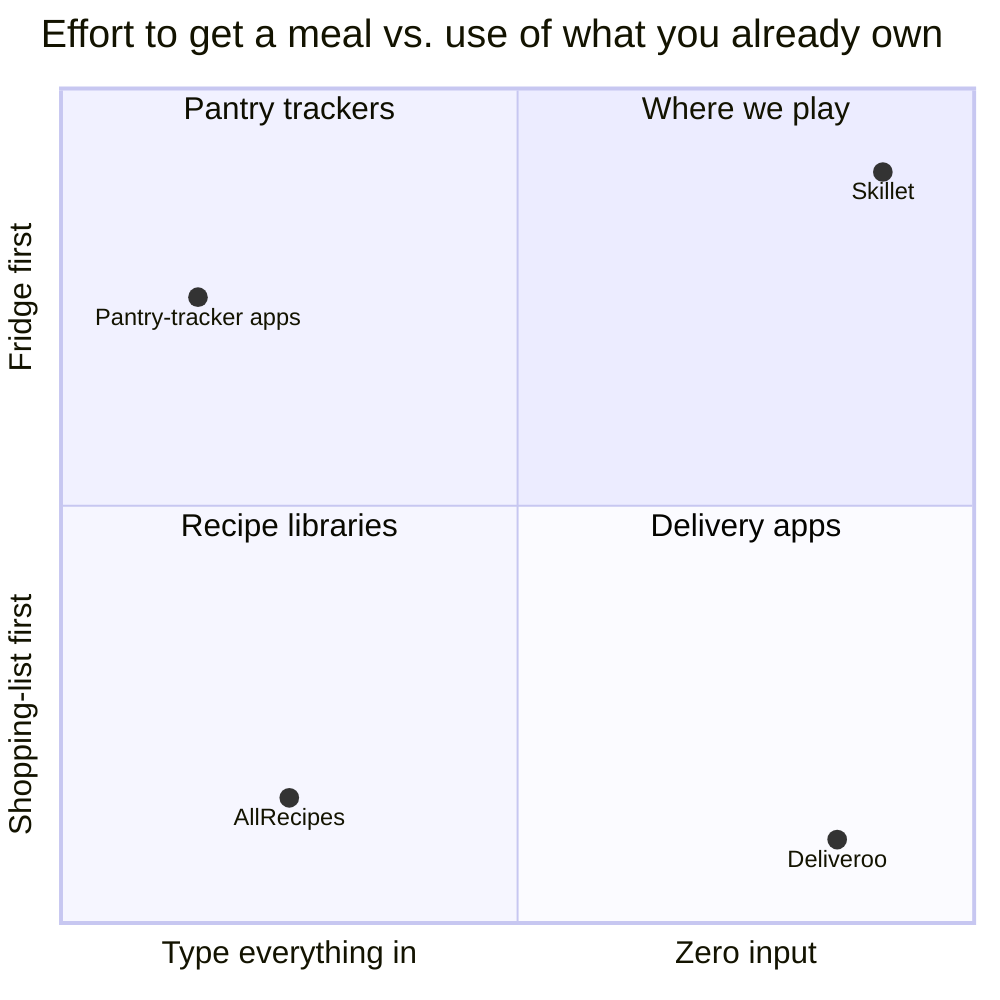
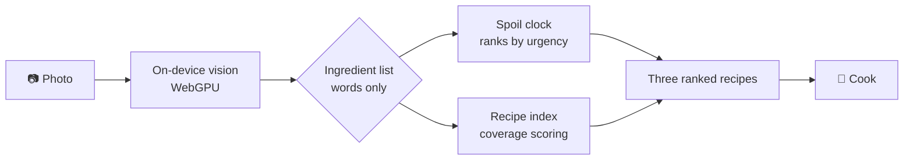
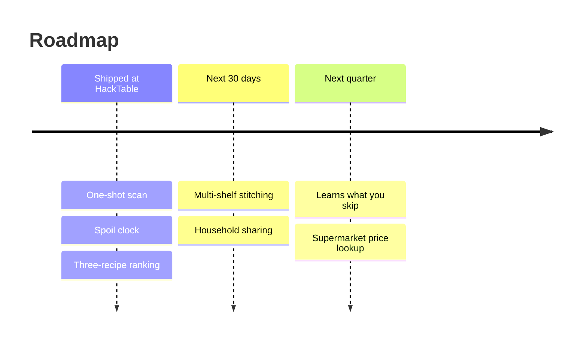

<!-- EXAMPLE 2 — the template as a STARTUP PITCH, filled with a FICTIONAL project.
     Deliberately a consumer app, not a dev tool, so you judge the template.
     ⚠️ Every number below is INVENTED and every source link points at "#".
     In a real README each one needs a real, clickable source — see the note
     in the template. Fake numbers are the fastest way to lose a judge. -->

<div align="center">



# Skillet

### Photograph your fridge, get dinner in three steps.

[](#)
[](#)
[](LICENSE)

**HackTable 2026** · Built in 24 hours · Consumer AI track

<br>



<sub><i>One photo of a half-empty fridge. Four seconds later: three recipes, ranked by what expires first.</i></sub>

</div>

---

## The problem

Every recipe app starts from the wrong end. They ask what you want to eat, then hand you a shopping list — but the real question at 7pm on a Tuesday is the reverse: *this* is what's in the fridge, some of it is about to turn, what can I make right now? Nobody wants to type nineteen ingredients into a form. So people order in, and the spinach dies in the drawer.

<div align="center">

<table>
<tr>
<td align="center" width="25%"><h2>$41B</h2><sub><b>TAM</b><br>Global recipe &amp; meal-planning apps<br><a href="#">source</a></sub></td>
<td align="center" width="25%"><h2>$3.8B</h2><sub><b>SAM</b><br>English-speaking mobile-first households<br><a href="#">source</a></sub></td>
<td align="center" width="25%"><h2>18%</h2><sub><b>CAGR</b><br>Category growth, 2024–2029<br><a href="#">source</a></sub></td>
<td align="center" width="25%"><h2>£17B</h2><sub><b>Wasted annually</b><br>UK household food thrown out<br><a href="#">source</a></sub></td>
</tr>
</table>

</div>

## Why now

On-device vision got good enough and cheap enough to run in a browser tab this year — a fridge scan that needed a server round trip and a GPU bill in 2024 now runs on the phone in under two seconds. That flips the unit economics: no inference cost per scan means no subscription needed to break even, which is exactly the wall every previous pantry app hit.

## What we built

Skillet takes one photo and works backwards. It identifies what's in the frame, estimates what's closest to spoiling from how it looks, and returns three recipes you can cook with what you already own — ranked so the dying ingredients get used first. No typing, no pantry setup, no account.

---

## How it works

<table>
<tr>
<td width="50%" valign="top">
<br>
<b>One-shot scan</b><br>
<sub>Point at an open fridge. Detects 200+ common items, including half-used and unlabelled ones.</sub>
</td>
<td width="50%" valign="top">
<br>
<b>Spoil clock</b><br>
<sub>Ranks everything by estimated days left, so the wilting herbs get cooked before the onions.</sub>
</td>
</tr>
<tr>
<td width="50%" valign="top">
<br>
<b>Three, not thirty</b><br>
<sub>Exactly three options, each fully cookable with what's on the shelf. No "you'll also need…".</sub>
</td>
<td width="50%" valign="top">
<br>
<b>Gap list</b><br>
<sub>Missing one thing? It tells you the single item that unlocks the most new recipes.</sub>
</td>
</tr>
</table>

- **Works offline after first load** — the recogniser runs on-device, so the photo never leaves your phone.
- **No account** — state lives in local storage. Nothing to sign up for, nothing to delete.
- **Share a cook** — one link hands someone the recipe plus the ingredients you actually had.

---

## Where we sit



Everyone else makes you choose between zero effort and using what you have. A photo is the only input cheap enough to do both.

## Business model

Free forever for the core scan. **£4/mo Plus** adds multi-shelf inventory, household sharing and the supermarket price lookup on the gap list. Because inference runs on-device, marginal cost per free user is effectively zero — so free users cost us nothing and the paid tier is pure margin.

---

## How it fits together



Recognition runs entirely in the browser, so photos never hit a server — only the detected ingredient *names* go to the ranker. The whole round trip is one network call carrying a list of words.

<details>
<summary><b>Repo map</b></summary>

| Path | What lives there |
|------|------------------|
| `src/vision/` | On-device recogniser, WebGPU inference, label mapping |
| `src/rank/` | Spoil-clock scoring and recipe coverage ranking |
| `src/recipes/` | The indexed recipe corpus and its build script |
| `src/ui/` | Camera capture, results, share sheet |

</details>

## Try it

**Requirements:** Node 20+ and a phone or webcam.

```sh
git clone https://github.com/example/skillet && cd skillet
npm install
npm run dev
```

Open `localhost:5173` on your phone, allow the camera, and point it at a fridge. First scan downloads the model (~40MB); every scan after that is instant.

## Built with

<p align="center">


</p>

## What's next



## Team

<table>
<tr>
<td align="center">
<a href="#"><br><sub><b>Ada</b></sub></a><br><sub>Vision</sub>
</td>
<td align="center">
<a href="#"><br><sub><b>Bo</b></sub></a><br><sub>Ranking</sub>
</td>
<td align="center">
<a href="#"><br><sub><b>Cai</b></sub></a><br><sub>Frontend</sub>
</td>
</tr>
</table>

## License

MIT — see [LICENSE](LICENSE).
